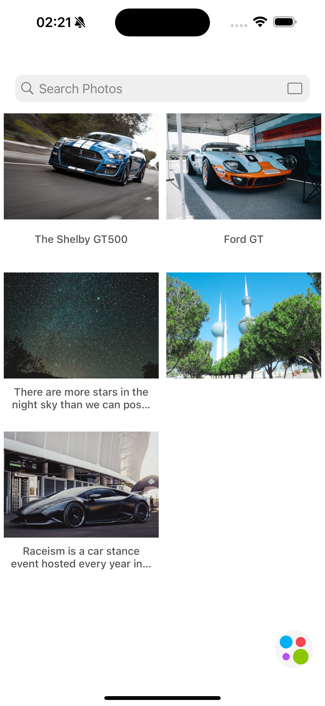
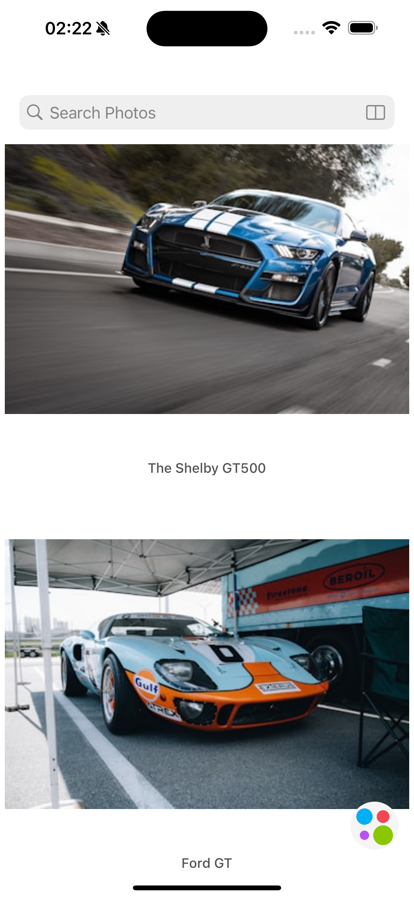
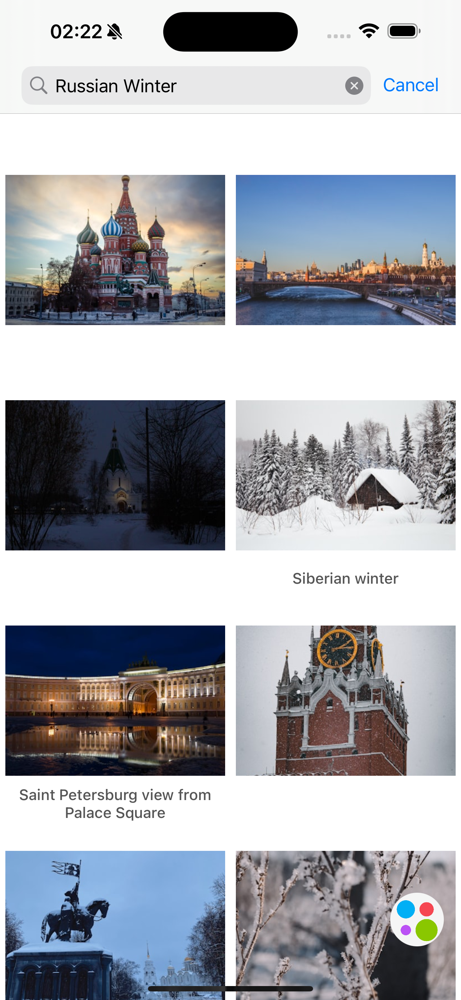
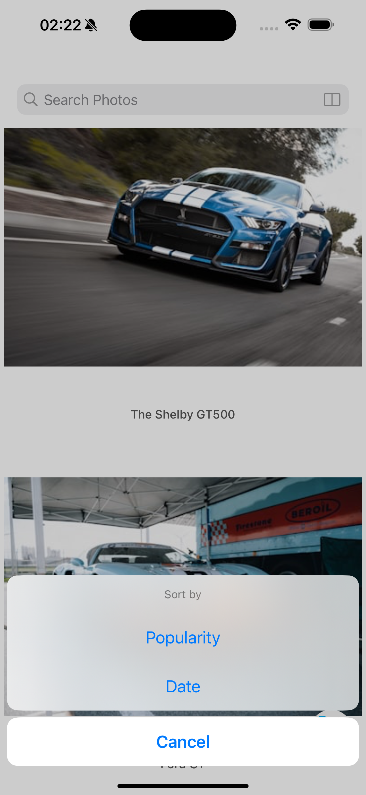
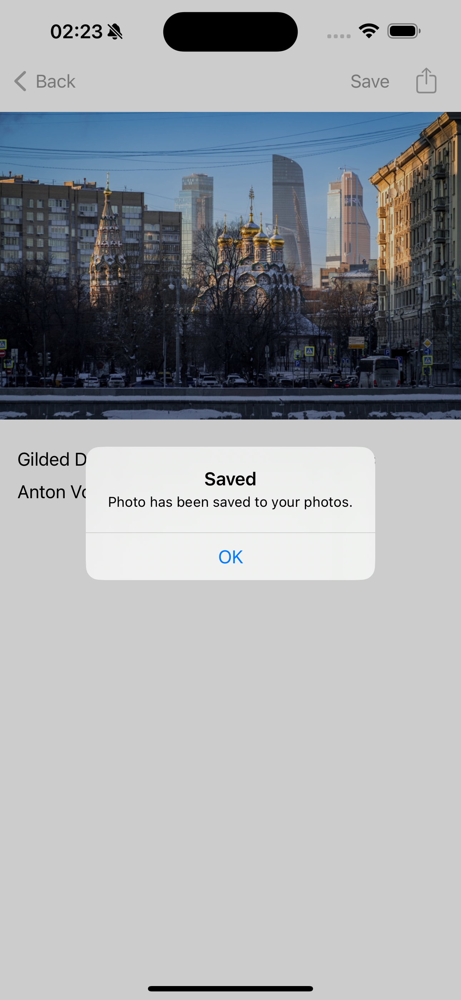
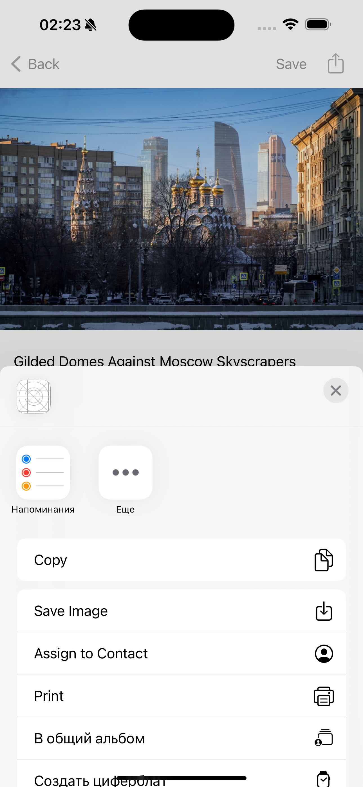

# Приложение для Поиска Медиа-Контента Unsplash

## Описание

**Приложение для Поиска Медиа-Контента** — это простое iOS-приложение для поиска и просмотра медиа-контента с использованием Unsplash API. Приложение состоит из двух основных экранов: экрана поиска и экрана с детальной информацией. Экран поиска позволяет пользователю находить медиа-контент по введённым запросам, просматривать результаты поиска и управлять историей запросов. Экран с детальной информацией предоставляет полную информацию о выбранном медиа-контенте.

## Основные Функции

- **Экран Поиска:**
  - **Поисковая Строка:** Введите запрос для поиска медиа-контента.
  - **История Поиска:** Сохранение и отображение до пяти последних запросов.
  - **Подсказки:** Отображение подсказок на основе ранее введённых запросов, фильтруемых по мере ввода.
  - **Результаты Поиска:** Отображение результатов в виде плиток с превью изображений и описанием.
  - **Фильтры Контента:** Возможность переключения между отображением в две колонки и одной колонке.
  - **Сортировка:** Сортировка результатов по популярности или дате (премиум-функция).
  - **Пагинация:** Загрузка дополнительных результатов при прокрутке (премиум-функция).

- **Экран Деталей:**
  - **Детали Контента:** Просмотр подробной информации о выбранном медиа-контенте, включая изображение, описание и информацию об авторе.
  - **Поделиться и Сохранить:** Функции для сохранения изображения в галерею или его отправки.

- **Состояния UI:**
  - **Отображение Контента:** Показывает медиа-контент или результаты поиска.
  - **Ошибка:** Отображение сообщений об ошибках при отсутствии необходимой информации или возникновении ошибки.
  - **Загрузка:** Индикация процесса загрузки контента.

## Реализация

- **Интеграция API:** Используется Unsplash API для получения результатов поиска и деталей медиа-контента.
- **Сетевые Запросы:** Реализовано с помощью `URLSession` для обработки сетевых запросов.
- **Пользовательский Интерфейс:** Построен полностью с использованием UIKit, без применения SwiftUI и сторонних библиотек.
- **Управление Состояниями:** Обрабатываются три основных состояния пользовательского интерфейса: отображение контента, ошибка и загрузка.

## Пройденный Путь

### Поисковая Функциональность
- Реализована строка поиска с автодополнением на основе ранее введённых запросов.
- Управление историей поиска и отображение до пяти последних запросов.
- Отображение результатов поиска в формате плиток с возможностью изменения макета и сортировки.

### Экран Деталей
- Отображение подробной информации о выбранном медиа-контенте, включая изображение, описание и информацию об авторе.
- Реализованы функции для поделиться изображением и сохранить его.

### Другие Функции
- **Фильтры:** Кнопка для переключения между двумя колонками и одной колонкой с изменением иконок.
- **Сортировка и Пагинация:** Сортировка по популярности или дате и пагинация для загрузки дополнительных результатов.

## Скриншоты

### Экран Поиска с историей

<table>
  <tr>
    <td align="center"></td>
    <td align="center"></td>
    <td align="center"></td>
  </tr>
</table>

### Экран Деталей

<table>
  <tr>
    <td align="center"></td>
  </tr>
</table>

### Дополнительные Экранные Кадры

<table>
  <tr>
    <td align="center"></td>
    <td align="center"></td>
    <td align="center"></td>
  </tr>
</table>

---
